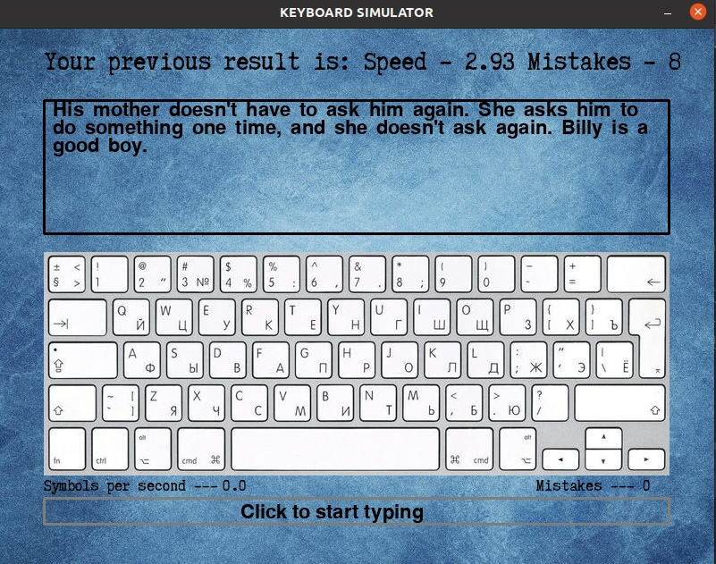
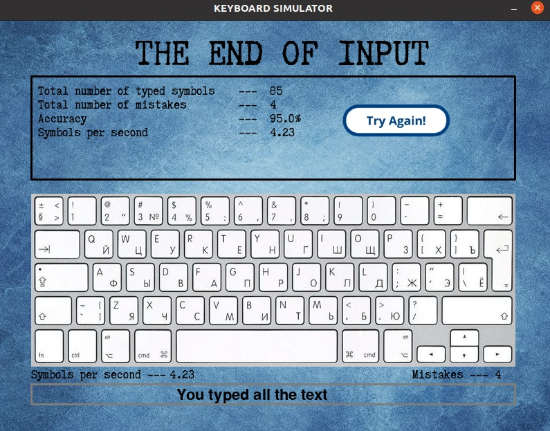

## Launching the keyboard simulator 
To start the keyboard simulator, you should have PyGame installed and register the following commands in the terminal:
```bash
git clone https://github.com/khoribz/review1.git -b dev
cd review1
python3 main.py
```
## Keyboard Simulator interface  
- At the top there is an inscription that informs about the results of the last launch.  
- The text to be printed is shown in the window just below. At the end of the input, data about the completed attempt is written in this window,
and the **"TRY AGAIN"** button appears for a new typing attempt. 
- Just below is a picture of the keyboard. 
- There are two entries under the keyboard image on the sides: on the left - the typing speed at the moment, on the right - the number of errors at the moment.  
- At the very bottom there is an input field. It is available by clicking the left mouse button on the area.

## What does a keyboard simulator look like? 
Before entering the text 
 

After entering the text 
 

## Program structure 
When the program starts, the text appears in the window (selected randomly from all the texts in the **texts** folder) to be printed, and the statistics of typing the previous text are imported into the inscription just above.
To start, you need to click on the "Click to enter text" window.
After that, with the input of the first character, the countdown will begin, and the screen will display the printing speed and the number of errors in real time.
Incorrect character input is considered an error (the user will find out about it, as the inscription **"MISTAKE"** appears at the top of the window).
At the same time, without printing any character correctly, access to printing subsequent characters will be closed.
If you enter a word correctly and press the space bar, the word disappears from the input panel.
At the end of typing, the statistics of typing this text is displayed in the upper window. It is exported to a file **data.txt** .
When you press the **"TRY AGAIN"** button, everything starts over.
When you click on the cross, the simulator closes.
