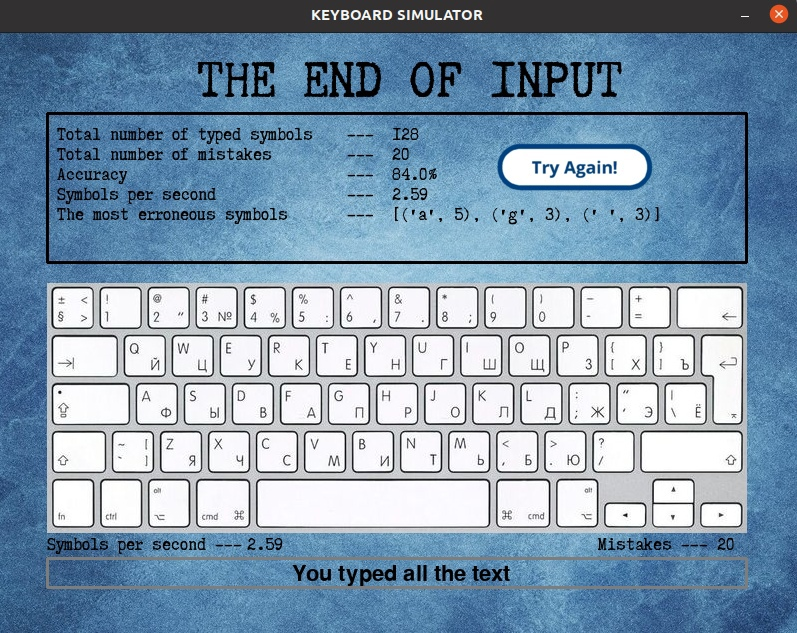

##Запуск клавиатурного тренажера  
**Чтобы запустить клавиатурный тренажер, необходимо, находясь в 
директории с main.py, прописать в консоли команду:**
```bash
python3 main.py
```
##Интерфейс клавиатурного тренажера  
**- Наверху находится надпись, которая сообщает о результатах прошлого запуска.**  
**- Чуть ниже в окне показывается текст, который нужно напечатать. При окончании ввода, в этом окне пишутся данные о совершенной попытке, 
и появляется кнопка ***"TRY AGAIN"*** для новой попытки набора текста.**  
**- Чуть ниже располагается картинка клавиатуры.**  
**- Под изображением клавиатуры по бокам находятся две записи: слева - скорость печатания в данный момент, справа - количество ошибок в данный момент.**  
**- В самом низу находится поле ввода. Оно доступно при нажатии левой кнопки мыши на область.**  

##Структура программы  
**При запуске программы в окне появляется текст(выбирается рандомом из всех текстов в папке ***texts***), который нужно напечатать, а чуть выше в надпись импортируется статистика набора прошлого текста.
Для старта нужно нажать на окошко "Нажмите, чтобы ввести текст".
После этого с вводом первого символа начнется отсчет времени, и на экран будет выводиться скорость печатания и количество ошибок в реальном времени.
Ошибкой считается неправильный ввод символа (пользователь, узнает об этом, так как появляется надпись ***"MISTAKE"*** в верхней части окна).
При этом не напечатав, какой-либо символ правильно, доступ к печатанию последующих символов будет закрытым.
При верном вводе слова и нажатии на пробел, слово исчезает из панели ввода.
При окончании набора текста, в верхнем окне показывается статистика набора данного текста. Она экспортируется в файл ***data.txt*** .
При нажатии кнопки ***"TRY AGAIN"*** все начинается сначала.
При нажатии на крестик тренажер закрывается.**

##Как выглядит клавиатурный тренажер?  
**До ввода текста**

**Во время ввода текста**  

**После ввода текста**  
